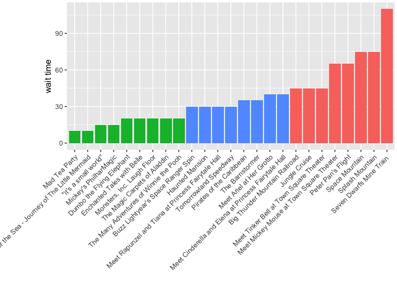

<!-- README.md is generated from README.Rmd. Please edit that file -->
parkhoppr
=========

[](https://travis-ci.org/LucyMcGowan/parkhoppr)

The goal of parkhoppr is to allow access to Disney World wait times.

Installation
------------

You can install parkhoppr from github with:

``` r
# install.packages("devtools")
devtools::install_github("LucyMcGowan/parkhoppr")
```

Example
-------

There is currently just one function - you can get wait times for rides at Disney World✨.

``` r
## load the library
library("parkhoppr")
## by default, get_wait_times() outputs Magic Kingdom wait times
get_wait_times()
#> # A tibble: 78 x 7
#>                                             name wait_time fast_pass
#>                                            <chr>     <int>     <lgl>
#>  1                        Stitch's Great Escape!        NA     FALSE
#>  2                    Monsters, Inc. Laugh Floor        20      TRUE
#>  3     Walt Disney World Railroad - Frontierland        NA     FALSE
#>  4             Walt Disney's Enchanted Tiki Room        NA     FALSE
#>  5                Sorcerers of the Magic Kingdom        NA     FALSE
#>  6                               The Barnstormer        35      TRUE
#>  7      Walt Disney World Railroad - Fantasyland        NA     FALSE
#>  8             Casey Jr. Splash 'N' Soak Station        NA     FALSE
#>  9                             Cinderella Castle        NA     FALSE
#> 10 Under the Sea - Journey of The Little Mermaid        10      TRUE
#> # ... with 68 more rows, and 4 more variables: status <chr>,
#> #   single_rider <lgl>, type <chr>, wait_time_lst <list>
```

You can specify the Disney World park you would like to retrieve wait times for using the `park` parameter.

``` r
get_wait_times(park = "hollywood_studios")
#> # A tibble: 43 x 7
#>                                          name wait_time fast_pass
#>                                         <chr>     <int>     <lgl>
#>  1 Lights, Motors, Action! Extreme Stunt Show        NA     FALSE
#>  2                           Toy Story Mania!        45      TRUE
#>  3        Wandering Oaken's Frozen Snowground        NA     FALSE
#>  4                            Take-Along Olaf        NA     FALSE
#>  5     Star Wars: Rebels - The Ultimate Guide        NA     FALSE
#>  6              "\"Frozen Fever\" Short Film"        NA     FALSE
#>  7                       Star Wars Launch Bay        NA     FALSE
#>  8                Star Wars: Path of the Jedi        NA     FALSE
#>  9      Star Wars at Walt Disney World Resort        NA     FALSE
#> 10              Star Wars Photo Opportunities        NA     FALSE
#> # ... with 33 more rows, and 4 more variables: status <chr>,
#> #   single_rider <lgl>, type <chr>, wait_time_lst <list>
```

have some fun!
--------------

``` r
library("dplyr")
library("ggplot2")
get_wait_times() %>%
  filter(fast_pass == TRUE) %>%
  mutate(wait_cat = case_when(
    wait_time >= 45 ~ "bad",
    wait_time >= 25 & wait_time < 45 ~ "ok",
    wait_time < 25 ~ "good"
  )) %>%
  arrange(wait_time) %>%
  mutate(name = forcats::fct_reorder(name, wait_time)) %>%
  ggplot(aes(name, wait_time, fill = wait_cat)) + 
  geom_bar(stat = "identity") + 
  theme(axis.text.x = element_text(angle = 45, hjust = 1),
        legend.position = "none",
        plot.margin = unit(c(0.1, 0.1, 0.1, 2), "cm")) +
  xlab("") +
  ylab("wait time")
```



*Shout out to the [themeparks](https://github.com/cubehouse/themeparks) library that inspired this little jaunt!*
